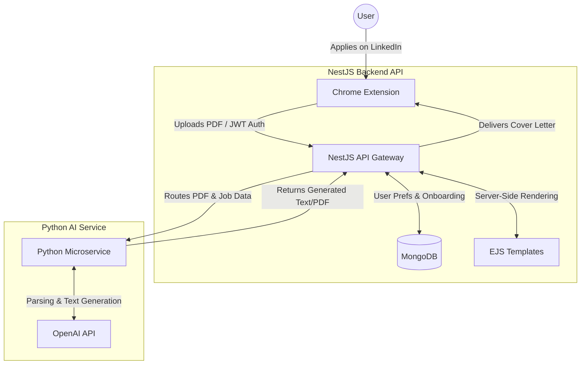

# 📡 Resume Parser Backend (CoverCraft)

This is the main orchestration backend built with **NestJS**. It serves as the central hub for the CoverCraft system, securely handling user authentication, onboarding data, media uploads (resume PDFs), and proxying heavy processing requests to the Python AI microservice.

---

## 🔗 System Components
* 🖥️ [CoverCraft Frontend Extension](https://github.com/SyedAzlanzar/CoverCraft) 
* 🤖 [CoverCraft Python Service](https://github.com/SyedAzlanzar/python-ai-server) 

---

## 🏗️ System Architecture Flow



---

## ✨ Key Features

* **Authentication & Security:** Secure user registration and login flows protected by Passport.js and JWT strategies.
* **User Onboarding:** Dedicated modules to capture, store, and manage user job preferences within MongoDB.
* **Media Management:** Secure endpoints to handle complex file uploads (resume PDFs) from the browser extension.
* **Microservice Orchestration:** Seamlessly proxies data to the Python AI service, which leverages the OpenAI API for precise resume parsing and context-aware cover letter generation.
* **Dynamic Rendering:** Utilizes EJS templates for server-side rendering of cover letter structures.

---

## 🛠️ Tech Stack

* **Framework:** NestJS (Node.js)
* **Language:** TypeScript
* **Security:** JWT (JSON Web Tokens)
* **Database:** MongoDB (Mongoose)
* **Templating:** EJS (Embedded JavaScript)
* **AI Integration:** OpenAI API (via Python microservice)

---

## 📂 Project Structure

```text
Resume-Parser-Backend
├─ src
│  ├─ auth
│  │  ├─ auth.controller.ts
│  │  ├─ auth.module.ts
│  │  └─ auth.service.ts
│  ├─ config
│  ├─ database
│  ├─ media
│  ├─ onboarding
│  ├─ user
│  ├─ template
│  └─ utils
├─ package.json
├─ tsconfig.json
└─ vercel.json

```

---

## 🚀 Getting Started

### 1. Environment Variables

Create a `.env` file in the project root and add the required configurations:

```env
MONGO_URI=mongodb://localhost:27017/covercraft
JWT_SECRET=your_jwt_secret_here
PORT=3000
PYTHON_SERVICE_URL=http://localhost:8000

```

### 2. Installation & Running

```bash
# Install dependencies
npm install

# Start the server in development mode
npm run start:dev

```

*Default server URL:* `http://localhost:3000` *(Change the PORT in your `.env` if needed).*

---

## 🔌 Core API Endpoints

* `POST /auth/register` — Register a new user and initialize onboarding.
* `POST /auth/login` — Authenticate user and return a secure JWT.
* **Note:** Secure endpoints are protected using a custom JWT guard located in `auth/guards`.

---

## 🧠 Integration & Deployment Notes

**Python AI Service Connection:**
The NestJS backend does not execute AI models directly. Instead, it coordinates storage references and user workflows, forwarding the data to the external Python service via the `PYTHON_SERVICE_URL`. The Python service then interfaces with the **OpenAI API** to handle the heavy lifting of resume data extraction and automated PDF generation.

**Production Best Practices:**

* Database: Use a managed MongoDB provider (like MongoDB Atlas) for production scaling.
* Security: Never commit your `.env` file. Secure `JWT_SECRET` and API keys via your deployment provider's secret manager (e.g., Vercel, AWS, Render).
* Orchestration: Consider containerizing (via Docker) both the NestJS gateway and the Python service for seamless deployment.
